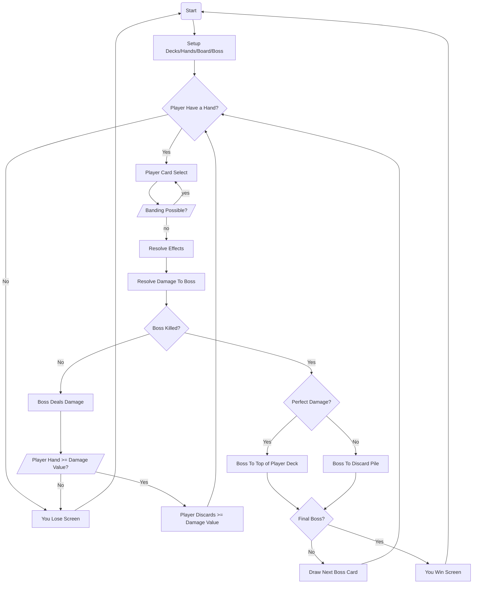

Basic Flow of application:

```mermaid
flowchart TD
    A(Start) --> B[Setup Decks/Hands/Board/Boss]

    B --> C{Player Have a Hand?}
    C -->|Yes|D[Player Card Select]
    C -->|No|N
    D -->E[/Banding Possible?/]
    E -->|yes|D
    E-->|no| F[Resolve Effects]
    F -->G[Resolve Damage To Boss]
    G -->H{Boss Killed?}
    H -->|Yes| I{Perfect Damage?}

    I--> |Yes| J[Boss To Top of Player Deck]
    I--> |No| K[Boss To Discard Pile]
    H -->|No| L[Boss Deals Damage]
    L -->M[/ Player Hand >= Damage Value?/]
    M --> |Yes|S[Player Discards >= Damage Value]

    S --> C
    M -->|No| N[You Lose Screen]
    N --> A
    J --> P{Final Boss?}
    K --> P
    P --> |No|Q[Draw Next Boss Card]
    Q --> C
    P --> |Yes|R[You Win Screen]

    R --> A
```
